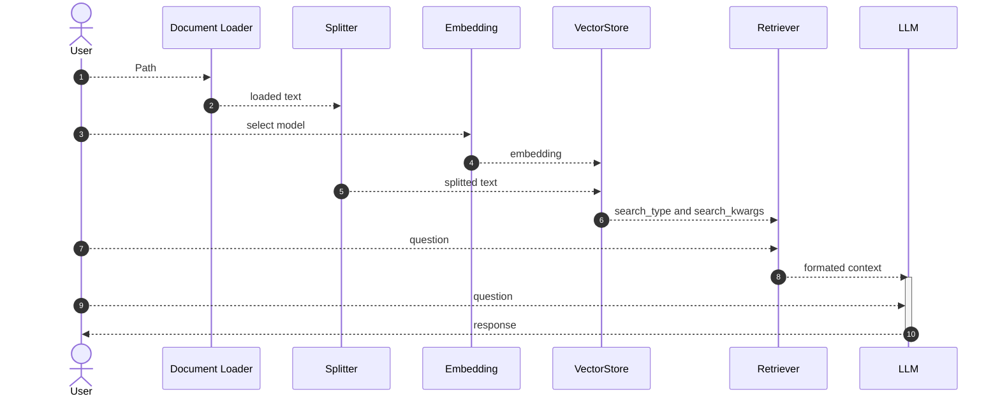

# RAG Workflow for LangChain and Ollama

This workflow demonstrates how to use RAG (Retrieval Augmented Generation) with LangChain.

## Diagram



## Installation

需要本地运行Ollama。

```Bash
$ poetry install
```

## How to run

```Bash
$ poetry run python rag/main.py ./data/matches.txt 
```

Or 

```Bash
$ poetry shell
$ python rag/main.py ./data/matches.txt
```

## Issues

- Webscraper: Need to find a way to bypass the bot detection.